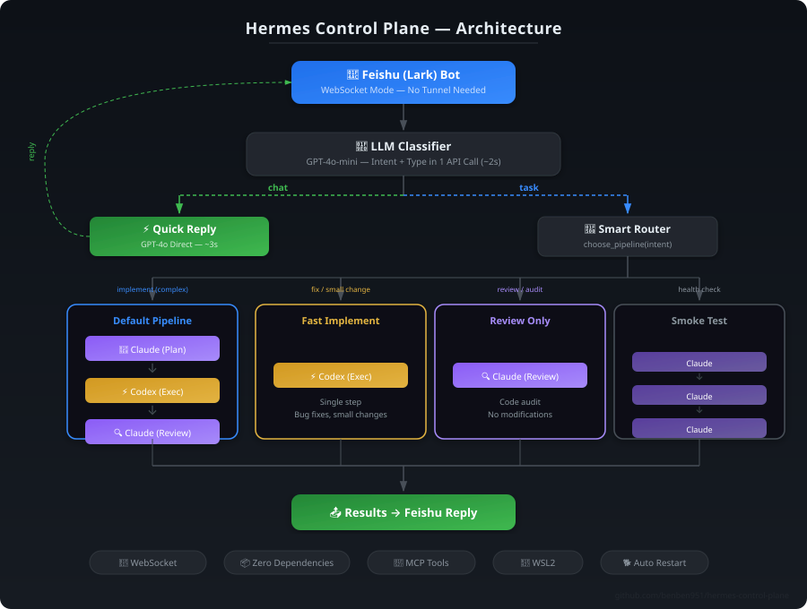

<p align="center">
  <h1 align="center">Hermes Control Plane</h1>
  <p align="center">
    <strong>Route tasks across OpenAI Codex CLI + Anthropic Claude Code via Feishu Bot</strong>
  </p>
  <p align="center">
    <a href="#features">Features</a> · <a href="#quick-start">Quick Start</a> · <a href="#pipelines">Pipelines</a> · <a href="#configuration">Configuration</a>
  </p>
  <p align="center">
    
    
    
    
  </p>
</p>

<p align="center">
  
</p>

## ✨ Features

- **WebSocket Mode** — Direct connection to Feishu cloud, no public tunnel (no ngrok/cloudflared)
- **Mobile Feishu Commands** — `/chat`, `/fast`, `/task`, `/review`, `/status`, `/handoff`, `/tail`, and `/approve` routes for phone-first control
- **Approval Gate** — high-risk submissions, pushes, destructive file actions, and secret reads are held until explicit mobile approval
- **Smart Routing** — GPT-4o-mini classifies intent in one API call, picks the optimal pipeline
- **4 Pipeline Modes** — Full orchestration, fast implement, review-only, or smoke test
- **Zero Python Dependencies** — Only stdlib (`http.server`, `json`, `hashlib`, etc.)
- **MCP Support** — Codex executor can use Playwright, filesystem, fetch, GitHub tools
- **Auto-Start** — Windows Startup folder + watchdog with crash recovery
- **WSL2-First** — Designed for WSL2 with Windows cross-filesystem support

## 🚀 Quick Start

### Prerequisites

- **Python 3.11+** (no pip packages needed)
- **OpenAI Codex CLI** — `npm install -g @openai/codex`
- **Anthropic Claude Code** — `npm install -g @anthropic-ai/claude-code`
- **Feishu App** — Create at [open.feishu.cn](https://open.feishu.cn)
- **WSL2** (Ubuntu recommended, but not required)

### 1. Install

```bash
git clone https://github.com/benben951/hermes-control-plane.git
cd hermes-control-plane
pip install -e .
```

### 2. Configure

```bash
cp config/hermes.local.example.toml config/hermes.local.toml
```

Edit `config/hermes.local.toml`:

```toml
[hermes]
default_profile = "wsl_mixed"
runs_root = "/home/<YOUR_USERNAME>/.hermes/runs"
shared_context_files = ["/home/<YOUR_USERNAME>/.hermes/context.md"]

[feishu]
mode = "app"
enabled = true

[feishu.app]
app_id = "your_feishu_app_id"
app_secret = "your_feishu_app_secret"

[profiles.wsl_mixed.codex]
enabled = true
command = ["codex", "exec", "--skip-git-repo-check", "-"]

[profiles.wsl_mixed.claude]
enabled = true
command = ["/mnt/c/Users/<YOUR_USERNAME>/.local/bin/claude.exe", "--bare", "-p", "--output-format", "json", "--permission-mode", "acceptEdits"]
run_cwd = "/mnt/c/Users/<YOUR_USERNAME>"
```

### 3. Run

```bash
hermes serve --config config/hermes.local.toml --port 8765 --mode websocket
```

## 🔄 Pipelines

### Mobile Feishu Commands

When using Hermes from a phone, prefix messages to choose the route explicitly:

| Prefix | Route | Use case |
|---|---|---|
| `/chat` | Quick API chat | Q&A, summaries, translation, planning, resume wording |
| `/fast` | `fast_implement` | Small code edits, config fixes, quick checks |
| `/task` | Default pipeline | Multi-step implementation, research plus code, platform work |
| `/review` | `review_only` | Code review, experiment review, safety checks |
| `/status taac` | Project status | Summarize TAAC best score, active run, and prepared run |
| `/status kaggle` | Project status | Summarize Nemotron SFT data and next LoRA step |
| `/handoff` | Project handoff | Compact TAAC + Kaggle mobile handoff |
| `/tail hermes` | Redacted log tail | Inspect recent Hermes logs without exposing access keys |
| `/approve <id>` | Approval gate | Release a pending high-risk action |

See [docs/MOBILE_FEISHU_WORKFLOW.md](docs/MOBILE_FEISHU_WORKFLOW.md) for the phone-first architecture and operational notes.

High-risk actions are not executed from a phone message immediately. Hermes creates a pending action and asks for an explicit `/approve <id>` before continuing. This includes TAAC platform training/evaluation, model publishing, Kaggle submissions, GitHub write actions, destructive file actions, and secret/credential access.

### Default Pipeline (Full Orchestration)

For feature development and complex tasks:

```
Claude (planner) → Codex (executor) → Claude (reviewer)
```

### Fast Implement Pipeline

For bug fixes and single-file changes:

```
Codex (executor)  ← skip planning & review
```

### Review Only Pipeline

For code audits and reviews:

```
Claude (reviewer)  ← read-only, no modifications
```

### Smoke Pipeline

Health check / connectivity test:

```
Claude → Claude → Claude
```

## ⚙️ Configuration

### Environment Variables

| Variable | Default | Description |
|---|---|---|
| `CODEX_CONFIG_PATH` | `~/.codex/config.toml` | Codex CLI config file |
| `CODEX_AUTH_PATH` | `~/.codex/auth.json` | Codex CLI auth credentials |
| `HERMES_CONTEXT_PATH` | `~/.hermes/context.md` | Shared context file injected into tasks |

### Feishu App Setup

1. Go to [open.feishu.cn](https://open.feishu.cn) → Create App
2. Enable **Bot** capability
3. Enable **WebSocket** mode (Events → Message Received)
4. Add permissions: `im:message`, `im:message:send_as_bot`
5. Copy `App ID` and `App Secret` into your config

### MCP Tools for Codex

Configure MCP servers in `~/.codex/config.toml`:

```toml
[mcp_servers.playwright]
command = "npx"
args = ["@playwright/mcp@latest"]

[mcp_servers.filesystem]
command = "npx"
args = ["-y", "@modelcontextprotocol/server-filesystem", "/home/user/projects"]

[mcp_servers.fetch]
command = "uvx"
args = ["mcp-server-fetch"]
```

## 🐕 Auto-Start (Windows)

### Startup Folder

Place in Windows Startup folder:

```
%APPDATA%\Microsoft\Windows\Start Menu\Programs\Startup\start_hermes_silent.bat
```

```bat
@echo off
start "" /min wsl.exe -e bash -lc "nohup bash ~/hermes_watchdog.sh > /dev/null 2>&1 & cd /path/to/hermes-control-plane && python3 launch_hermes.py start"
```

### Watchdog

The watchdog monitors Hermes every 30 seconds:

- Auto-restarts on crash
- Rate limited: max 10 restarts per hour
- Logs to `/tmp/hermes_watchdog.log`

## 📁 Project Structure

```text
hermes-control-plane/
├── config/
│   ├── hermes.local.example.toml    # Config template
│   ├── feishu.example.toml          # Feishu config template
│   ├── agents.example.toml          # Agent profiles
│   └── routes.example.json          # Route rules
├── docs/
│   ├── architecture.svg             # Architecture diagram
│   ├── ARCHITECTURE.md              # Architecture deep-dive
│   ├── FEISHU.md                    # Feishu integration guide
│   └── WSL2_FIRST.md               # WSL2 setup notes
├── src/hermes_control_plane/
│   ├── server.py                    # Feishu WebSocket + message handler
│   ├── runner.py                    # Pipeline executor
│   ├── router.py                    # Intent-based pipeline selector
│   ├── contracts.py                 # Data classes (TaskSpec, etc.)
│   └── feishu.py                    # Feishu API client
├── examples/                        # Task templates
└── tests/
```

## 🤔 How It Works

1. **User sends a message** in Feishu → WebSocket delivers to Hermes
2. **LLM Classifier** (GPT-4o-mini) analyzes in one API call:
   - `msg_type`: `chat` (quick Q&A) or `task` (needs agent execution)
   - `intent`: `implement`, `fix`, `review`, `audit`, `research`, `verify`
3. **Router** picks pipeline based on intent:
   - `fix` / small `implement` → `fast_implement` (Codex only)
   - `review` / `audit` → `review_only` (Claude only)
   - large `implement` → `default` (full pipeline)
4. **Runner** executes pipeline stages sequentially
5. **Results** sent back to Feishu

## 🤝 Contributing

PRs welcome! Especially:

- **New pipelines** — define your own in `config/`
- **New integrations** — Slack, Discord, WeChat, etc.
- **Classifier improvements** — better intent recognition

## 📄 License

MIT © [benben951](https://github.com/benben951)
